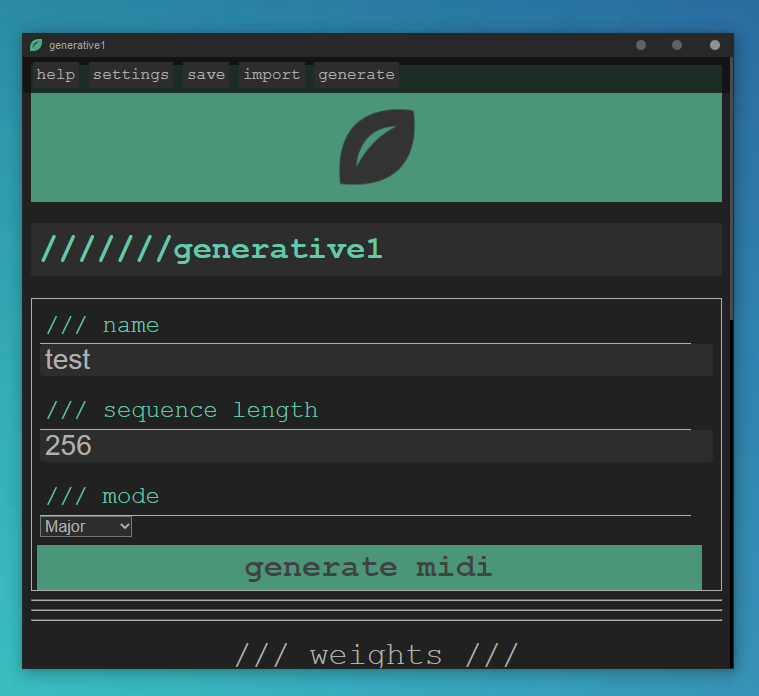
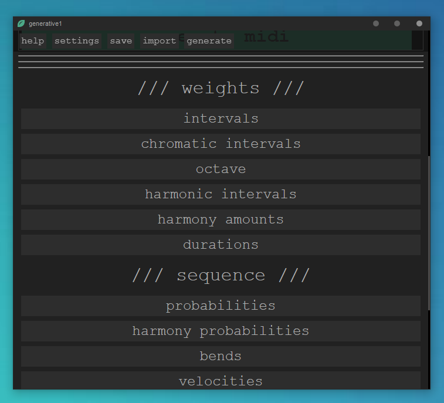
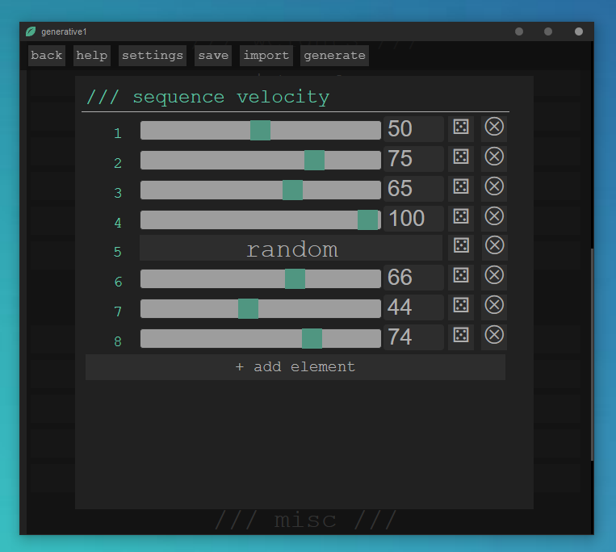
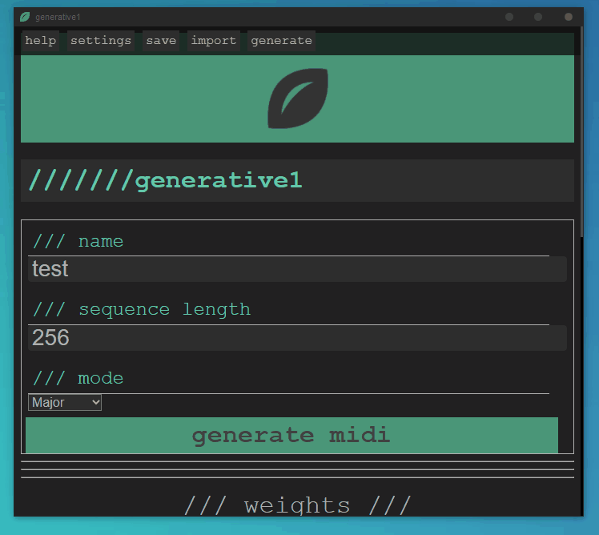

# generative1

A tool for producing generative (procedurally generated) MIDI files. 

## [Download Here](https://github.com/matdombrock/generative1/releases/latest)

-------

## Generative music

> Generative : having the power or function of generating, originating, producing, or reproducing

— Websters Dictionary

> Generative music is a term popularized by Brian Eno to describe music that is ever-different and changing, and that is created by a system. 

— Wikipedia

> One of the notes repeats every 23 1/2 seconds. It is in fact a long loop running around a series of tubular aluminum chairs in Conny Plank’s studio. The next lowest loop repeats every 25 7/8 seconds or something like that. The third one every 29 15/16 seconds or something. What I mean is they all repeat in cycles that are called incommensurable — they are not likely to come back into sync again. 

— Brian Eno

-------

If you are familiar with the "random" world generation in games like Minecraft and many others, then you already understand the basic idea at play here. These games use a technique known as [procedural generation](https://en.wikipedia.org/wiki/Procedural_generation) to build their world based on pseudo-random inputs (usually some kind of [noise](https://en.wikipedia.org/wiki/Perlin_noise)) and a set of rules.

This differs from full randomness because of the rule set at play. By setting clever rules, the developers of these games can generate seemingly plausible landscapes from pure noise.  

Here we are applying the concept of procedural generation to create generative music instead of 3d worlds.

Note: *According to the strictest interpretation of what "generative music" is, this software does not actually create generative music. This is because the midi files created here are inherently finite and truly generative music is infinite.*

## Screenshots






## So this software makes music?

No not exactly. It would be more accurate to say it writes or composes music. This software does not actually output any audio of any kind. What it outputs is a [MIDI file](https://en.wikipedia.org/wiki/MIDI) which is like a kind of sheet music for computers and [synths](https://en.wikipedia.org/wiki/Synthesizer). 

You can use the MIDI files that this software generates in a [digital audio workstation](https://en.wikipedia.org/wiki/Digital_audio_workstation) or with a synth to create actual music. 

## Is this a VST?

No. This software is not a [VST](https://en.wikipedia.org/wiki/Virtual_Studio_Technology). This software is a desktop executable built with [Electron](https://en.wikipedia.org/wiki/Electron_(software_framework)). I am considering building something like this as a VST in the future but it would not be easily possible to package this software as a VST.

## How does it work?

This software allows you to create a set of parameters that will be used to procedurally generate a MIDI file. 

There are two main concepts you should be familiar with.

### Sequences
If you have experience with electronic music production you probably are already familiar with the concept of a sequence (or sequencer). If not please take a second to look at this [Wikipedia page](https://en.wikipedia.org/wiki/Music_sequencer).

Essentially a sequence is a series of events (elements) that happen in chronological order. When the last event is completed the sequence will start again from the first event.

The thing that sets the sequencing capabilities of this software apart from most other sequencers is that each parameter can have a unique sequence length. This allows for **incommensurable sequence relationships**.

### Weights
Weights define the probability of various aspects of the music by assigning a "weight" (as opposed to an N% chance). Generally speaking, the more weight assigned to a given value, the more likely that value is to be selected for any given element in the sequence. 

So, an element with a weight of 50 is more likely to get chosen than an element with a weight of 25 but it will only be chosen about 2x as often. 

If we were drawing numbers from a hat, you could think of the weight as being the amount of paper slips with given value on them. So if "A" has a weight of 50 and "B" has a weight of 25, we can think of the hat as containing 50 slips that say "A" and 25 that say "B".


## Using the software

Head over to the [releases](https://github.com/matdombrock/generative1/releases/latest) section and grab the latest build. 

You will need to bypass the Windows security screen because this software is not signed. 

If you have doubts about security, feel free to build the software yourself from the source files. 

**Currently only Windows is supported but other operating systems are fully possible down the road.** 

-------

## Development Info

This is a Vue/Electron project. It uses the [Vue Electron Builder Plugin](https://nklayman.github.io/vue-cli-plugin-electron-builder/) for building. 


## Project setup
```
npm install
```

### Compiles and hot-reloads for development
```
npm run electron:serve
```

### Compiles and minifies for production
```
npm run electron:build
```

### Lints and fixes files
```
npm run lint
```

### Customize configuration
See [Configuration Reference](https://cli.vuejs.org/config/).
